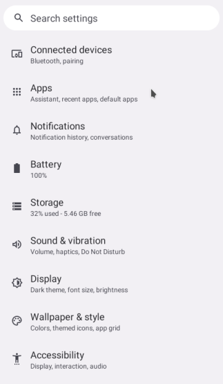
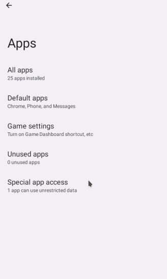
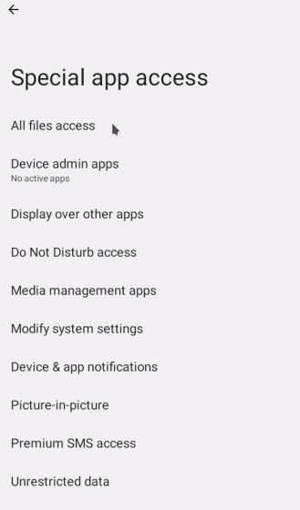
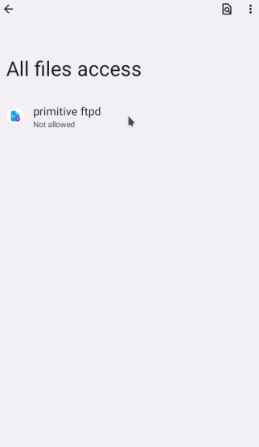
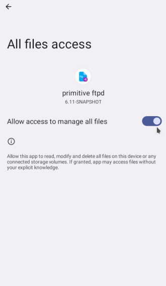

# Primitive FTPd

FTP and SFTP server app for Android with external SD-card access.

<!--

-->

How can you use this server on your device to access your files (see discussion regarding permission and restriction below in terms of Google and Play)?
* Install from F-Droid
* Download from GitHub releases
* Use SAF
* Use QuickShare

|  |  |  |
| --- | --- | --- |

You may download latest development snapshot from [GitHub packages](https://github.com/wolpi/prim-ftpd/packages/).

## Some features:
* Can optionally be started on system boot
* Shows statusbar notification when server is running
* Server can be stopped from statusbar
* Shows information about how to connect on main screen
* Optional wakelock while server runs to avoid uploads and downloads to be aborted
* Optional encryption via sftp
* Server can be announced
* Public key authentication for sftp
* Optional anonymous login
* Widget to start/stop server
* Plugins for powertoggles and tasker
* Android 7 Quicksettings Tile
* Optional root access
* Optional support for Android Storage Access Framework to be able to write external SD-cards
* Can calculate hash for complete files on server side (sftp extended command)

## Translation
You may help translate this app in [hosted weblate](https://hosted.weblate.org/projects/pftpd/pftpd/).

## SFTP vs SCP

When accessing this app's server via scp, it might be necessary for some clients (specific versions of ssh coming with linux distros), to specify option -O. 

## Running in the background

Depending your Android version, Android keeps closing apps running in the background. Even if you think you configured explicitly not do this. Please visit https://dontkillmyapp.com/ on more information about battery saving options.

## External SD card read/write access - Android Storage Access Framework

Basically it requires selecting a directory, not the root of the SD-card.

If you select the root of the SD-card, it will work temporarily, but the permission possibly gets revoked and you have to re-select regularly. Revocation can happen as soon as you close the app, or Android kills it within a few hours or days (see above).

Depending on your Android version, permanent access to the root of the SD-card can be possible, if you first select a directory on your SD-card, then select the root of the SD-card. Though after an update, maybe you have to repeat these steps again. You can check whether the permission is stored permanently by visiting Android Settings &#8594; Apps &#8594; Special access &#8594; Directory access. If you see the primitive ftpd app there after you selected the root of the SD-card, there is a chance, that the permission to access the root of the SD-card will not be revoked.

## All files access permission

Google introduces more and more restrictions to filesystem access to Android. In order to access all
your files through this server you might have to grant it 'all files access' permission in Anroid settings.

To be able to allow 'All files access' an app must declare `android.permission.MANAGE_EXTERNAL_STORAGE` in it's manifest file.
Google has a policy wether an app is allowed to declare that permission and be published on Google Play.
As you can see below this app is considered as not compliant.

Mail from Google:

